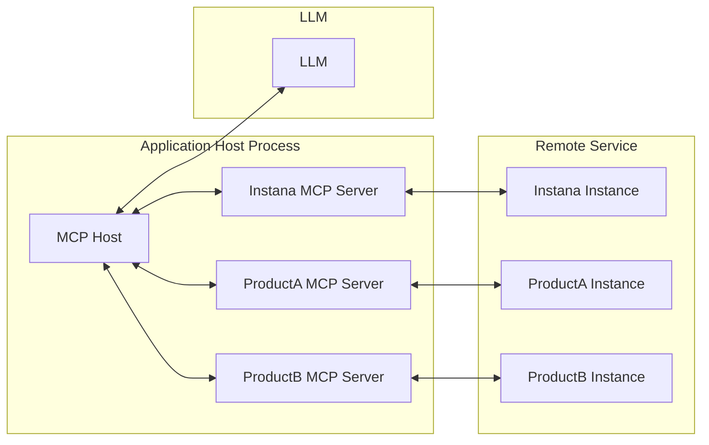
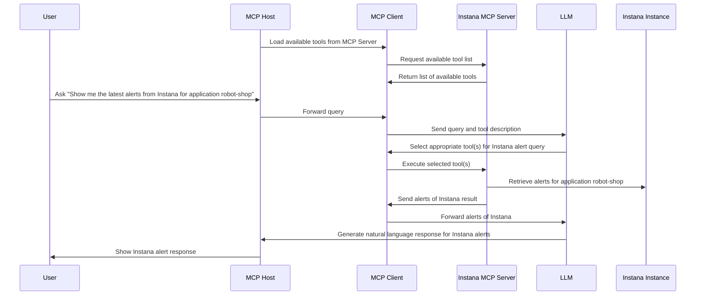

<!-- START doctoc generated TOC please keep comment here to allow auto update -->
<!-- DON'T EDIT THIS SECTION, INSTEAD RE-RUN doctoc TO UPDATE -->
<!-- mcp-name: io.github.instana/mcp-instana -->

- [MCP Server for IBM Instana](#mcp-server-for-ibm-instana)
  - [Architecture Overview](#architecture-overview)
  - [Workflow](#workflow)
  - [Prerequisites](#prerequisites)
    - [Option 1: Install from PyPI (Recommended)](#option-1-install-from-pypi-recommended)
    - [Option 2: Development Installation](#option-2-development-installation)
      - [Installing uv](#installing-uv)
      - [Setting Up the Environment](#setting-up-the-environment)
    - [Header-Based Authentication for Streamable HTTP Mode](#header-based-authentication-for-streamable-http-mode)
  - [Starting the Local MCP Server](#starting-the-local-mcp-server)
    - [Server Command Options](#server-command-options)
      - [Using the CLI (PyPI Installation)](#using-the-cli-pypi-installation)
      - [Using Development Installation](#using-development-installation)
    - [Starting in Streamable HTTP Mode](#starting-in-streamable-http-mode)
      - [Using CLI (PyPI Installation)](#using-cli-pypi-installation)
      - [Using Development Installation](#using-development-installation-1)
    - [Starting in Stdio Mode](#starting-in-stdio-mode)
      - [Using CLI (PyPI Installation)](#using-cli-pypi-installation-1)
      - [Using Development Installation](#using-development-installation-2)
    - [Tool Categories](#tool-categories)
      - [Using CLI (PyPI Installation)](#using-cli-pypi-installation-2)
      - [Using Development Installation](#using-development-installation-3)
    - [Verifying Server Status](#verifying-server-status)
    - [Common Startup Issues](#common-startup-issues)
  - [Setup and Usage](#setup-and-usage)
    - [Claude Desktop](#claude-desktop)
      - [Streamable HTTP Mode](#streamable-http-mode)
      - [Stdio Mode](#stdio-mode)
    - [Kiro Setup](#kiro-setup)
    - [GitHub Copilot](#github-copilot)
      - [Streamable HTTP Mode](#streamable-http-mode-1)
      - [Stdio Mode](#stdio-mode-1)
  - [Supported Features](#supported-features)
  - [Available Tools](#available-tools)
  - [Tool Filtering](#tool-filtering)
    - [Available Tool Categories](#available-tool-categories)
    - [Usage Examples](#usage-examples)
      - [Using CLI (PyPI Installation)](#using-cli-pypi-installation-3)
      - [Using Development Installation](#using-development-installation-4)
    - [Benefits of Tool Filtering](#benefits-of-tool-filtering)
  - [Example Prompts](#example-prompts)
  - [Docker Deployment](#docker-deployment)
    - [Docker Architecture](#docker-architecture)
      - [**pyproject.toml** (Development)](#pyprojecttoml-development)
      - [**pyproject-runtime.toml** (Production)](#pyproject-runtimetoml-production)
    - [Building the Docker Image](#building-the-docker-image)
      - [**Prerequisites**](#prerequisites)
      - [**Build Command**](#build-command)
  - [Troubleshooting](#troubleshooting)
    - [**Docker Issues**](#docker-issues)
      - [**Container Won't Start**](#container-wont-start)
      - [**Connection Issues**](#connection-issues)
      - [**Performance Issues**](#performance-issues)
    - [**General Issues**](#general-issues)

<!-- END doctoc generated TOC please keep comment here to allow auto update -->

# MCP Server for IBM Instana

The Instana MCP server enables seamless interaction with the Instana observability platform, allowing you to access real-time observability data directly within your development workflow.

It serves as a bridge between clients (such as AI agents or custom tools) and the Instana REST APIs, converting user queries into Instana API requests and formatting the responses into structured, easily consumable formats.

The server supports both **Streamable HTTP** and **Stdio** transport modes for maximum compatibility with different MCP clients. For more details, refer to the [MCP Transport Modes specification](https://modelcontextprotocol.io/specification/2025-06-18/basic/transports).

## Architecture Overview



## Workflow

Consider a simple example: You're using an MCP Host (such as Claude Desktop, VS Code, or another client) connected to the Instana MCP Server. When you request information about Instana alerts, the following process occurs:

1. The MCP client retrieves the list of available tools from the Instana MCP server
2. Your query is sent to the LLM along with tool descriptions
3. The LLM analyzes the available tools and selects the appropriate one(s) for retrieving Instana alerts
4. The client executes the chosen tool(s) through the Instana MCP server
5. Results (latest alerts) are returned to the LLM
6. The LLM formulates a natural language response
7. The response is displayed to you



## Prerequisites

### Option 1: Install from PyPI (Recommended)

The easiest way to use mcp-instana is to install it directly from PyPI:

```shell
pip install mcp-instana
```

After installation, you can run the server using the `mcp-instana` command directly.

### Option 2: Development Installation

For development or local customization, you can clone and set up the project locally.

#### Installing uv

This project uses `uv`, a fast Python package installer and resolver. To install `uv`, you have several options:

**Using pip:**
```shell
pip install uv
```

**Using Homebrew (macOS):**
```shell
brew install uv
```

For more installation options and detailed instructions, visit the [uv documentation](https://github.com/astral-sh/uv).

#### Setting Up the Environment

After installing `uv`, set up the project environment by running:

```shell
uv sync
```

### Header-Based Authentication for Streamable HTTP Mode

When using **Streamable HTTP mode**, you must pass Instana credentials via HTTP headers. This approach enhances security and flexibility by:

- Avoiding credential storage in environment variables
- Enabling the use of different credentials for different requests
- Supporting shared environments where environment variable modification is restricted

**Required Headers:**
- `instana-base-url`: Your Instana instance URL
- `instana-api-token`: Your Instana API token

**Authentication Flow:**
1. HTTP headers (`instana-base-url`, `instana-api-token`) must be present in each request
2. Requests without these headers will fail

This design ensures secure credential transmission where credentials are only sent via headers for each request, making it suitable for scenarios requiring different credentials or avoiding credential storage in environment variables.

## Starting the Local MCP Server

Before configuring any MCP client (Claude Desktop, GitHub Copilot, or custom MCP clients), you need to start the local MCP server. The server supports two transport modes: **Streamable HTTP** and **Stdio**.

### Server Command Options

#### Using the CLI (PyPI Installation)

If you installed mcp-instana from PyPI, use the `mcp-instana` command:

```bash
mcp-instana [OPTIONS]
```

#### Using Development Installation

For local development, use the `uv run` command:

```bash
uv run src/core/server.py [OPTIONS]
```

**Available Options:**
- `--transport <mode>`: Transport mode (choices: `streamable-http`, `stdio`)
- `--env KEY=VALUE`: Set environment variable (can be repeated for multiple variables, e.g., `--env INSTANA_BASE_URL=https://... --env INSTANA_API_TOKEN=...`)
- `--debug`: Enable debug mode with additional logging
- `--log-level <level>`: Set the logging level (choices: `DEBUG`, `INFO`, `WARNING`, `ERROR`, `CRITICAL`)
- `--tools <categories>`: Comma-separated list of tool categories to enable (e.g., infra,app,events,website). Enabling a category will also enable its related prompts. For example: `--tools infra` enables the infra tools and all infra-related prompts.
- `--list-tools`: List all available tool categories and exit
- `--port <port>`: Port to listen on (default: 8080)
- `--help`: Show help message and exit

### Starting in Streamable HTTP Mode

**Streamable HTTP mode** provides a REST API interface and is recommended for most use cases.

#### Using CLI (PyPI Installation)

```bash
# Start with all tools enabled (default)
mcp-instana --transport streamable-http

# Start with debug logging
mcp-instana --transport streamable-http --debug

# Start with a specific log level
mcp-instana --transport streamable-http --log-level WARNING

# Start with specific tool categories only
mcp-instana --transport streamable-http --tools infra,events

# Combine options (specific log level, custom tools)
mcp-instana --transport streamable-http --log-level DEBUG --tools app,events
```

#### Using Development Installation

```bash
# Start with all tools enabled (default)
uv run src/core/server.py --transport streamable-http

# Start with debug logging
uv run src/core/server.py --transport streamable-http --debug

# Start with a specific log level
uv run src/core/server.py --transport streamable-http --log-level WARNING

# Start with specific tool and prompts categories only
uv run src/core/server.py --transport streamable-http --tools infra,events

# Combine options (specific log level, custom tools and prompts)
uv run src/core/server.py --transport streamable-http --log-level DEBUG --tools app,events
```

**Key Features of Streamable HTTP Mode:**
- Uses HTTP headers for authentication (no environment variables needed)
- Supports different credentials per request
- Better suited for shared environments
- Default port: 8080
- Endpoint: `http://0.0.0.0:8080/mcp/`

### Starting in Stdio Mode

**Stdio mode** uses standard input/output for communication and requires environment variables for authentication.

#### Using CLI (PyPI Installation)

```bash
# Option 1: Set environment variables first
export INSTANA_BASE_URL="https://your-instana-instance.instana.io"
export INSTANA_API_TOKEN="your_instana_api_token"

# Start the server (stdio is the default if no transport specified)
mcp-instana

# Or explicitly specify stdio mode
mcp-instana --transport stdio

# Option 2: Use --env flag to set environment variables directly
mcp-instana --env INSTANA_BASE_URL=https://your-instana-instance.instana.io --env INSTANA_API_TOKEN=your_instana_api_token

# Or with explicit stdio mode
mcp-instana --transport stdio --env INSTANA_BASE_URL=https://your-instana-instance.instana.io --env INSTANA_API_TOKEN=your_instana_api_token
```

#### Using Development Installation

```bash
# Option 1: Set environment variables first
export INSTANA_BASE_URL="https://your-instana-instance.instana.io"
export INSTANA_API_TOKEN="your_instana_api_token"

# Start the server (stdio is the default if no transport specified)
uv run src/core/server.py

# Or explicitly specify stdio mode
uv run src/core/server.py --transport stdio

# Option 2: Use --env flag to set environment variables directly
uv run src/core/server.py --env INSTANA_BASE_URL=https://your-instana-instance.instana.io --env INSTANA_API_TOKEN=your_instana_api_token

# Or with explicit stdio mode
uv run src/core/server.py --transport stdio --env INSTANA_BASE_URL=https://your-instana-instance.instana.io --env INSTANA_API_TOKEN=your_instana_api_token
```

**Key Features of Stdio Mode:**
- Uses environment variables for authentication (can be set via `export` or `--env` flag)
- Direct communication via stdin/stdout
- Required for certain MCP client configurations
- The `--env` flag provides a convenient way to set credentials without modifying shell environment

### Tool Categories

You can optimize server performance by enabling only the tools and prompts categories you need:

#### Using CLI (PyPI Installation)

```bash
# List all available categories
mcp-instana --list-tools

# Enable specific categories
mcp-instana --transport streamable-http --tools infra,app
mcp-instana --transport streamable-http --tools events
```

#### Using Development Installation

```bash
# List all available categories
uv run src/core/server.py --list-tools

# Enable specific categories
uv run src/core/server.py --transport streamable-http --tools infra,app
uv run src/core/server.py --transport streamable-http --tools events
```

**Available Categories:**
- **`infra`**: Infrastructure monitoring tools and prompts (resources, catalog, topology, analyze, metrics)
- **`app`**: Application performance tools and prompts (resources, metrics, alerts, catalog, topology, analyze, settings, global alerts)
- **`events`**: Event monitoring tools and prompts (Kubernetes events, agent monitoring)
- **`website`**: Website monitoring tools and prompts (metrics, catalog, analyze, configuration)

### Verifying Server Status

Once started, you can verify the server is running:

**For Streamable HTTP mode:**
```bash
# Check server health
curl http://0.0.0.0:8080/mcp/

# Or with custom port
curl http://0.0.0.0:9000/mcp/
```

**For Stdio mode:**
The server will start and wait for stdin input from MCP clients.

### Common Startup Issues

**Certificate Issues:**
If you encounter SSL certificate errors, ensure your Python environment has access to system certificates:
```bash
# macOS - Install certificates for Python
/Applications/Python\ 3.13/Install\ Certificates.command
```

**Port Already in Use:**
If port 8080 is already in use, specify a different port:
```bash
uv run src/core/server.py --transport streamable-http --port 9000
```

**Missing Dependencies:**
Ensure all dependencies are installed:
```bash
uv sync
```

## Setup and Usage

### Claude Desktop

Claude Desktop supports both Streamable HTTP and Stdio modes for MCP integration.

Configure Claude Desktop by editing the configuration file:

**File Locations:**
- **macOS**: `~/Library/Application Support/Claude/claude_desktop_config.json`
- **Windows**: `%APPDATA%\Claude\claude_desktop_config.json`

#### Streamable HTTP Mode

The Streamable HTTP mode provides a REST API interface for MCP communication using JSON-RPC over HTTP.

**Step 1: Start the MCP Server in Streamable HTTP Mode**

Before configuring Claude Desktop, you need to start the MCP server in Streamable HTTP mode. Please refer to the [Starting the Local MCP Server](#starting-the-local-mcp-server) section for detailed instructions.

**Step 2: Configure Claude Desktop**

Configure Claude Desktop to pass Instana credentials via headers:

```json:claude_desktop_config.json
{
  "mcpServers": {
    "Instana MCP Server": {
      "command": "npx",
      "args": [
        "mcp-remote", "http://0.0.0.0:8080/mcp/",
        "--allow-http",
        "--header", "instana-base-url: https://your-instana-instance.instana.io",
        "--header", "instana-api-token: your_instana_api_token"
      ]
    }
  }
}
```

**Note:** To use npx, we recommend first installing NVM (Node Version Manager), then using it to install Node.js.
Installation instructions are available at: https://nodejs.org/en/download

**Step 3: Test the Connection**

Restart Claude Desktop. You should now see Instana MCP Server in the Claude Desktop interface as shown below:


You can now run queries in Claude Desktop:

```
get me all endpoints from Instana
```


#### Stdio Mode

**Configuration using CLI (PyPI Installation - Recommended):**

**Option 1: Using environment variables in config:**
```json
{
  "mcpServers": {
    "Instana MCP Server": {
      "command": "mcp-instana",
      "args": ["--transport", "stdio"],
      "env": {
        "INSTANA_BASE_URL": "https://your-instana-instance.instana.io",
        "INSTANA_API_TOKEN": "your_instana_api_token"
      }
    }
  }
}
```

**Option 2: Using --env flag (alternative method):**
```json
{
  "mcpServers": {
    "Instana MCP Server": {
      "command": "mcp-instana",
      "args": [
        "--transport", "stdio",
        "--env", "INSTANA_BASE_URL=https://your-instana-instance.instana.io",
        "--env", "INSTANA_API_TOKEN=your_instana_api_token"
      ]
    }
  }
}
```

**Note:** If you encounter "command not found" errors, use the full path to mcp-instana. Find it with `which mcp-instana` and use that path instead.

**Configuration using Development Installation:**

**Option 1: Using environment variables in config:**
```json
{
  "mcpServers": {
    "Instana MCP Server": {
      "command": "uv",
      "args": [
        "--directory",
        "<path-to-mcp-instana-folder>",
        "run",
        "src/core/server.py"
      ],
      "env": {
        "INSTANA_BASE_URL": "https://your-instana-instance.instana.io",
        "INSTANA_API_TOKEN": "your_instana_api_token"
      }
    }
  }
}
```

**Option 2: Using --env flag (alternative method):**
```json
{
  "mcpServers": {
    "Instana MCP Server": {
      "command": "uv",
      "args": [
        "--directory",
        "<path-to-mcp-instana-folder>",
        "run",
        "src/core/server.py",
        "--env", "INSTANA_BASE_URL=https://your-instana-instance.instana.io",
        "--env", "INSTANA_API_TOKEN=your_instana_api_token"
      ]
    }
  }
}
```
### Kiro Setup

Kiro is an agentic IDE, not an extension that can be downloaded into VS Code or some other IDE.

**Step 1: Download and install Kiro for your operating system from https://kiro.dev/.**

**Step 2: After installation, launch Kiro and open any project in the IDE.**


**Step 3: Click the Kiro (Ghost) icon on the left sidebar to access Kiro's features.**


**Step 4: Select the Edit Config icon in the top right corner of the MCP Servers section.**


**Step 5: Open the MCP server configuration file (mcp.json) and configure it based on your preferred transport mode:**

#### Streamable HTTP Mode (Recommended for Kiro)

```json
{
  "mcpServers": {
    "Instana MCP Server": {
      "command": "npx",
      "args": [
        "mcp-remote", "http://0.0.0.0:8080/mcp/",
        "--allow-http",
        "--header", "instana-base-url: https://your-instana-instance.instana.io",
        "--header", "instana-api-token: your_instana_api_token"
      ]
    }
  }
}
```

**Note:** Make sure to start the MCP server in streamable-http mode before using this configuration:
```bash
mcp-instana --transport streamable-http
```

#### Stdio Mode

**Option 1: Using environment variables in config:**
```json
{
  "mcpServers": {
    "Instana MCP Server": {
      "command": "mcp-instana",
      "args": ["--transport", "stdio"],
      "env": {
        "INSTANA_BASE_URL": "https://your-instana-instance.instana.io",
        "INSTANA_API_TOKEN": "your_instana_api_token"
      }
    }
  }
}
```

**Option 2: Using --env flag (alternative method):**
```json
{
  "mcpServers": {
    "Instana MCP Server": {
      "command": "mcp-instana",
      "args": [
        "--transport", "stdio",
        "--env", "INSTANA_BASE_URL=https://your-instana-instance.instana.io",
        "--env", "INSTANA_API_TOKEN=your_instana_api_token"
      ]
    }
  }
}
```

**Step 6: After saving the file, Click the Enable MCP button and you'll see your MCP server and its available tools appear in the bottom-left section of Kiro.**


**Step 7: Go to the AI Chat panel, enter a prompt related to your MCP server, and view the response directly within Kiro.**


### GitHub Copilot

GitHub Copilot supports MCP integration through VS Code configuration.
For GitHub Copilot integration with VS Code, refer to this [setup guide](https://code.visualstudio.com/docs/copilot/setup).

#### Streamable HTTP Mode

**Step 1: Start the MCP Server in Streamable HTTP Mode**

Before configuring VS Code, you need to start the MCP server in Streamable HTTP mode. Please refer to the [Starting the Local MCP Server](#starting-the-local-mcp-server) section for detailed instructions.

**Step 2: Configure VS Code**

Refer to [Use MCP servers in VS Code](https://code.visualstudio.com/docs/copilot/chat/mcp-servers) for detailed configuration.

You can directly create or update `.vscode/mcp.json` with the following configuration:

```json:.vscode/mcp.json
{
  "servers": {
    "Instana MCP Server": {
      "command": "npx",
      "args": [
        "mcp-remote", "http://0.0.0.0:8080/mcp/",
        "--allow-http",
        "--header", "instana-base-url: https://your-instana-instance.instana.io",
        "--header", "instana-api-token: your_instana_api_token"
      ],
      "env": {
        "PATH": "/usr/local/bin:/bin:/usr/bin",
        "SHELL": "/bin/sh"
      }
    }
  }
}
```

**Note:** Replace the following values with your actual configuration:
- `instana-base-url`: Your Instana instance URL
- `instana-api-token`: Your Instana API token
- `command`: Update the npx path to match your system's Node.js installation (e.g., `/path/to/your/node/bin/npx`)
- Environment variables: Adjust PATH and other environment variables as needed for your system


#### Stdio Mode

**Step 1: Create VS Code MCP Configuration**

**Using CLI (PyPI Installation - Recommended):**

Create `.vscode/mcp.json` in your project root:

**Option 1: Using environment variables in config:**
```json:.vscode/mcp.json
{
  "servers": {
    "Instana MCP Server": {
      "command": "mcp-instana",
      "args": ["--transport", "stdio"],
      "env": {
        "INSTANA_BASE_URL": "https://your-instana-instance.instana.io",
        "INSTANA_API_TOKEN": "your_instana_api_token"
      }
    }
  }
}
```

**Option 2: Using --env flag (alternative method):**
```json:.vscode/mcp.json
{
  "servers": {
    "Instana MCP Server": {
      "command": "mcp-instana",
      "args": [
        "--transport", "stdio",
        "--env", "INSTANA_BASE_URL=https://your-instana-instance.instana.io",
        "--env", "INSTANA_API_TOKEN=your_instana_api_token"
      ]
    }
  }
}
```

**Using Development Installation:**

Create `.vscode/mcp.json` in your project root:

**Option 1: Using environment variables in config:**
```json:.vscode/mcp.json
{
  "servers": {
    "Instana MCP Server": {
      "command": "uv",
      "args": [
        "--directory",
        "/absolute/path/to/your/project/mcp-instana",
        "run",
        "src/core/server.py"
      ],
      "env": {
        "INSTANA_BASE_URL": "https://your-instana-instance.instana.io",
        "INSTANA_API_TOKEN": "your_instana_api_token"
      }
    }
  }
}
```

**Option 2: Using --env flag (alternative method):**
```json:.vscode/mcp.json
{
  "servers": {
    "Instana MCP Server": {
      "command": "uv",
      "args": [
        "--directory",
        "/absolute/path/to/your/project/mcp-instana",
        "run",
        "src/core/server.py",
        "--env", "INSTANA_BASE_URL=https://your-instana-instance.instana.io",
        "--env", "INSTANA_API_TOKEN=your_instana_api_token"
      ]
    }
  }
}
```

**Note:** Replace the following values with your actual configuration:
- For CLI installation: Ensure `mcp-instana` is in your PATH
- For development installation: 
  - `command`: Update the uv path to match your system's uv installation (e.g., `/path/to/your/uv/bin/uv` or `/usr/local/bin/uv`)
  - `--directory`: Update with the absolute path to your mcp-instana project directory
- `INSTANA_BASE_URL`: Your Instana instance URL
- `INSTANA_API_TOKEN`: Your Instana API token

**Step 2: Manage Server in VS Code**

1. **Open `.vscode/mcp.json`** - you'll see server management controls at the top
2. **Click `Start`** next to `Instana MCP Server` to start the server
3. Running status along with the number of tools indicates the server is running

**Step 3: Test Integration**

Switch to Agent Mode in GitHub Copilot and reload tools.
Here is an example of a GitHub Copilot response:


## Supported Features

- [x] **Unified Application & Infrastructure Management** (`manage_instana_resources`)
  - [x] Application Metrics
    - [x] Query application metrics with flexible filtering
    - [x] List services and endpoints
    - [x] Group by tags and aggregate metrics
  - [x] Application Alert Configuration
    - [x] Find active alert configurations
    - [x] Get alert configuration versions
    - [x] Create, update, and delete alert configurations
    - [x] Enable, disable, and restore alert configurations
    - [x] Update historic baselines
  - [x] Global Application Alert Configuration
    - [x] Manage global alert configurations
    - [x] Version control for global alerts
  - [x] Application Settings
    - [x] Manage application perspectives
    - [x] Configure endpoints and services
    - [x] Manage manual services
  - [x] Application Catalog
    - [x] Get application tag catalog
    - [x] Get application metric catalog
- [x] **Infrastructure Analysis** (`analyze_infrastructure`)
  - [x] Two-pass elicitation for entity/metric queries
  - [x] Dynamic support for all entity types from Instana API catalog (JVM, Kubernetes, Docker, hosts, databases, message queues, and more)
  - [x] Automatically synchronized with your Instana installation's available plugins
  - [x] Flexible metric aggregation (max, mean, sum, etc.)
  - [x] Advanced filtering by tags and properties
  - [x] Grouping and ordering capabilities
  - [x] Time range queries
- [x] **Unified Events Management** (`manage_events_resources`)
  - [x] Events Monitoring
    - [x] Get Event by ID (operation="get_event")
    - [x] Get Events by IDs (operation="get_events_by_ids")
    - [x] Get Agent Monitoring Events (operation="get_agent_monitoring_events")
    - [x] Get Kubernetes Info Events (operation="get_kubernetes_info_events")
    - [x] Get Issues (operation="get_issues")
    - [x] Get Incidents (operation="get_incidents")
    - [x] Get Changes (operation="get_changes")
  - [x] Smart routing to specialized event tools
  - [x] Unified parameter validation (time ranges, max_events)
  - [x] Support for natural language time ranges ("last 24 hours", "last 2 days")
  - [x] Event filtering and optimization
- [x] **Unified Website Management** (`manage_website_resources`)
  - [x] Website Analyze (resource_type="analyze")
    - [x] Get Website Beacon Groups - grouped/aggregated beacon data (operation="get_beacon_groups")
    - [x] Get Website Beacons - individual beacon data with pagination (operation="get_beacons")
    - [x] Automatic tag validation and catalog-based elicitation workflow
    - [x] Response summarization (70-80% payload reduction)
    - [x] Support for multiple beacon types: PAGELOAD, PAGECHANGE, RESOURCELOAD, CUSTOM, HTTPREQUEST, ERROR
  - [x] Website Catalog (resource_type="catalog")
    - [x] Get Website Metrics Catalog (operation="get_metrics")
    - [x] Get Website Tag Catalog by beacon type and use case (operation="get_tag_catalog")
  - [x] Website Configuration (resource_type="configuration")
    - [x] Get All Websites (operation="get_all")
    - [x] Get Website by ID or name with automatic name resolution (operation="get")
  - [x] Advanced Configuration - READ ONLY (resource_type="advanced_config")
    - [x] Get Geo-Location Configuration (operation="get_geo_config")
    - [x] Get IP Masking Configuration (operation="get_ip_masking")
    - [x] Get Geo Mapping Rules (operation="get_geo_rules")
- [x] **Unified Automation Management** (`manage_automation`)
  - [x] Action Catalog (resource_type="catalog")
    - [x] List all available automation actions (operation="get_actions")
    - [x] Get detailed information about a specific action (operation="get_action_details")
    - [x] Search for matching actions by name/description (operation="get_action_matches")
    - [x] Get action matches by application or snapshot ID and time window (operation="get_action_matches_by_id_and_time_window")
    - [x] Get available action types (operation="get_action_types")
    - [x] Get available action tags (operation="get_action_tags")
  - [x] Action History (resource_type="history")
    - [x] List action execution instances with filtering (operation="list")
    - [x] Get details of a specific action execution (operation="get_details")
- [x] **Custom Dashboards** (`manage_custom_dashboards`)
  - [x] Get all custom dashboards
  - [x] Get specific dashboard by ID
  - [x] Create new custom dashboard
  - [x] Update existing custom dashboard
  - [x] Delete custom dashboard
  - [x] Get shareable users for dashboard
  - [x] Get shareable API tokens for dashboard

## Available Tools

| Tool                                                          | Category                       | Description                                            |
|---------------------------------------------------------------|--------------------------------|------------------------------------------------------- |
| `manage_instana_resources`                                    | Application & Infrastructure   | Unified tool for managing application metrics, alert configs, settings, and catalog |
| `manage_website_resources`                                    | Website Monitoring             | Unified smart router for website analyze, catalog, configuration, and advanced config operations |
| `manage_custom_dashboards`                                    | Custom Dashboards              | Unified tool for managing custom dashboard CRUD operations |
| `analyze_infrastructure`                                      | Infrastructure Analyze         | Two-pass infrastructure analysis with entity/metric elicitation |
| `manage_automation`                                           | Automation                     | Unified smart router for automation: browse action catalog (get_actions, get_action_details, get_action_matches, get_action_types, get_action_tags) and view execution history (list, get_details) |
| `manage_events_resources`                                     | Events                         | Unified smart router for events monitoring: get event by ID, get events by IDs, Kubernetes events, agent monitoring, issues, incidents, and changes |
| `manage_slo`                                                  | SLO Management                 | Unified smart router for SLO configurations, reports, alerts, and correction windows with intelligent timezone handling |


## Tool Filtering

The MCP server supports selective tool loading to optimize performance and reduce resource usage. You can enable only the tool categories you need for your specific use case.

### Available Tool Categories

- **`router`**: Unified application and infrastructure management
  - `manage_instana_resources`: Single tool for application metrics, alert configurations, settings, and catalog
  - Supports application perspectives, endpoints, services, and manual services
  - Manages both application-specific and global alert configurations
  - Provides access to application tag catalog and metric catalog

- **`dashboard`**: Custom dashboard management
  - `manage_custom_dashboards`: CRUD operations for custom dashboards
  - Supports dashboard creation, retrieval, updates, and deletion
  - Manages shareable users and API tokens for dashboards

- **`infra`**: Infrastructure analysis tools
  - `analyze_infrastructure`: Two-pass infrastructure analysis with entity/metric elicitation
  - Dynamically supports all entity types available in your Instana installation (automatically loaded from API catalog)
  - Includes JVM, Kubernetes, Docker, hosts, databases, message queues, and any custom or newly added entity types
  - Flexible metric aggregation, filtering, grouping, and time range queries

- **`automation`**: Automation action tools
  - `manage_automation`: Unified smart router for automation catalog and execution history
  - Action Catalog: browse actions, get details, search by name/description, filter by application or snapshot ID
  - Action History: list execution instances with filtering, get execution details

- **`events`**: Event monitoring tools
  - Events: Kubernetes events, agent monitoring, incidents, issues, changes and system event tracking

- **`website`**: Website monitoring tools
  - Website Metrics: Performance measurement for websites
  - Website Catalog: Website metadata and definitions
  - Website Analyze: Website performance analysis
  - Website Configuration: Website configuration management

- **`slo`**: Service Level Objective (SLO) management
  - `manage_slo`: Unified smart router for comprehensive SLO operations
  - **Configuration Management**: Create, read, update, delete SLO configurations with support for time-based and event-based indicators
  - **Report Generation**: Generate detailed SLO reports with SLI values, error budgets, burn rates, and time-series charts
  - **Alert Configuration**: Manage SLO alert configs for error budget monitoring and burn rate tracking
  - **Correction Windows**: Create and manage maintenance windows to exclude planned downtime from SLO calculations
  - **Intelligent Timezone Handling**: Automatic timezone elicitation for datetime inputs to ensure accurate time context
  - **Two-Pass Elicitation**: Interactive parameter gathering for complex operations requiring multiple inputs

### Usage Examples

#### Using CLI (PyPI Installation)

```bash
# Enable only router (unified app/infra management) and events tools
mcp-instana --tools router,events --transport streamable-http

# Enable only infrastructure analysis tools
mcp-instana --tools infra --transport streamable-http

# Enable router and infrastructure analysis
mcp-instana --tools router,infra --transport streamable-http

# Enable events and website tools
mcp-instana --tools events,website --transport streamable-http

# Enable dashboard and router tools
mcp-instana --tools dashboard,router --transport streamable-http

# Enable all tools (default behavior)
mcp-instana --transport streamable-http

# List all available tool categories and their tools
mcp-instana --list-tools
```

#### Using Development Installation

```bash
# Enable only router (unified app/infra management) and events tools
uv run src/core/server.py --tools router,events --transport streamable-http

# Enable only infrastructure analysis tools
uv run src/core/server.py --tools infra --transport streamable-http

# Enable router and infrastructure analysis
uv run src/core/server.py --tools router,infra --transport streamable-http

# Enable events and website tools
uv run src/core/server.py --tools events,website --transport streamable-http

# Enable dashboard and router tools
uv run src/core/server.py --tools dashboard,router --transport streamable-http

# Enable all tools (default behavior)
uv run src/core/server.py --transport streamable-http

# List all available tool categories and their tools
uv run src/core/server.py --list-tools
```

### Benefits of Tool Filtering

- **Performance**: Reduced startup time and memory usage
- **Security**: Limit exposure to only necessary APIs
- **Clarity**: Focus on specific use cases (e.g., only infrastructure monitoring)
- **Resource Efficiency**: Lower CPU and network usage

## SLO Smart Router

The SLO Smart Router (`manage_slo`) is a unified tool that provides comprehensive Service Level Objective (SLO) management capabilities. It intelligently routes operations to specialized handlers for configurations, reports, alerts, and correction windows.

### Architecture

The smart router acts as a single entry point for all SLO-related operations, routing requests to four specialized clients:

1. **SLO Configuration Client** - Manages SLO definitions and targets
2. **SLO Report Client** - Generates performance reports and metrics
3. **SLO Alert Client** - Handles alert configurations for SLO violations
4. **SLO Correction Client** - Manages maintenance windows and corrections

### Key Features

#### 1. Unified Interface
- Single tool (`manage_slo`) for all SLO operations
- Consistent parameter structure across all resource types
- Simplified API surface for AI agents and developers

#### 2. Intelligent Timezone Handling
- Automatic timezone elicitation for datetime inputs
- Supports multiple datetime formats (ISO 8601, human-readable)
- Timezone-aware conversions to prevent time-related errors
- Format: `"datetime|timezone"` (e.g., `"10 March 2026, 2:00 PM|IST"`)

#### 3. Two-Pass Elicitation
- Interactive parameter gathering for complex operations
- Validates required fields before API calls
- Provides helpful error messages and suggestions
- Reduces failed API requests due to missing parameters

#### 4. Resource Type Routing
The router supports four resource types:
- `configuration` - SLO definitions and targets
- `report` - Performance reports and metrics
- `alert` - Alert configurations for SLO violations
- `correction` - Maintenance windows and corrections

### Usage Examples

#### Configuration Management

```python
# List all SLO configurations
resource_type="configuration"
operation="get_all"
params={"page_size": 20, "query": "api"}

# Get specific SLO by ID
resource_type="configuration"
operation="get_by_id"
params={"id": "slo-abc123"}

# Create new SLO configuration
resource_type="configuration"
operation="create"
params={
    "payload": {
        "name": "API Latency SLO",
        "entity": {
            "type": "application",
            "applicationId": "app-123",
            "boundaryScope": "ALL"
        },
        "indicator": {
            "type": "timeBased",
            "blueprint": "latency",
            "threshold": 100,
            "aggregation": "P95"
        },
        "target": 0.95,
        "timeWindow": {
            "type": "rolling",
            "duration": 7,
            "durationUnit": "day"
        },
        "tags": ["production", "api"]
    }
}

# Update SLO configuration (requires complete payload)
resource_type="configuration"
operation="update"
params={
    "id": "slo-abc123",
    "payload": {
        # Complete SLO configuration with updated fields
    }
}

# Delete SLO configuration
resource_type="configuration"
operation="delete"
params={"id": "slo-abc123"}
```

#### Report Generation

```python
# Generate SLO report with timezone-aware datetime
resource_type="report"
operation="get"
params={
    "slo_id": "slo-abc123",
    "var_from": "10 March 2026, 2:00 PM|IST",
    "to": "17 March 2026, 2:00 PM|IST"
}

# Report with Unix timestamps (milliseconds)
resource_type="report"
operation="get"
params={
    "slo_id": "slo-abc123",
    "var_from": "1741604400000",
    "to": "1742209200000"
}

# Report with correction window exclusions
resource_type="report"
operation="get"
params={
    "slo_id": "slo-abc123",
    "var_from": "10 March 2026, 2:00 PM|UTC",
    "to": "17 March 2026, 2:00 PM|UTC",
    "exclude_correction_id": "correction-xyz"
}
```

#### Alert Configuration

```python
# Find active alerts for an SLO
resource_type="alert"
operation="find_active"
params={"slo_id": "slo-abc123"}

# Get alert configuration by ID
resource_type="alert"
operation="find"
params={"id": "alert-def456"}

# Create burn rate alert
resource_type="alert"
operation="create"
params={
    "payload": {
        "name": "High Burn Rate Alert",
        "description": "Alert when error budget burns too fast",
        "sloIds": ["slo-abc123"],
        "rule": {
            "alertType": "ERROR_BUDGET",
            "metric": "BURN_RATE"
        },
        "severity": 10,
        "alertChannelIds": ["channel-123"],
        "timeThreshold": {
            "expiry": 604800000,
            "timeWindow": 604800000
        },
        "customPayloadFields": [
            {
                "type": "staticString",
                "key": "environment",
                "value": "production"
            }
        ],
        "threshold": {
            "type": "staticThreshold",
            "operator": ">=",
            "value": 2.0
        },
        "burnRateTimeWindows": {
            "longTimeWindow": {
                "duration": 1,
                "durationType": "hour"
            },
            "shortTimeWindow": {
                "duration": 5,
                "durationType": "minute"
            }
        }
    }
}

# Disable alert
resource_type="alert"
operation="disable"
params={"id": "alert-def456"}

# Enable alert
resource_type="alert"
operation="enable"
params={"id": "alert-def456"}
```

#### Correction Windows

```python
# List all correction windows
resource_type="correction"
operation="get_all"
params={"page_size": 20, "query": "maintenance"}

# Get correction window by ID
resource_type="correction"
operation="get_by_id"
params={"id": "correction-xyz"}

# Create maintenance window with timezone
resource_type="correction"
operation="create"
params={
    "payload": {
        "name": "Planned Maintenance",
        "scheduling": {
            "duration": 2,
            "durationUnit": "hour",
            "startTime": "12 March 2026, 1:00 AM|IST"
        },
        "sloIds": ["slo-abc123"],
        "description": "Database upgrade maintenance",
        "tags": ["maintenance", "database"],
        "active": True
    }
}

# Create recurring correction window
resource_type="correction"
operation="create"
params={
    "payload": {
        "name": "Weekly Maintenance",
        "scheduling": {
            "duration": 1,
            "durationUnit": "hour",
            "startTime": "15 March 2026, 2:00 AM|UTC",
            "recurrent": True,
            "recurrentRule": "FREQ=WEEKLY;BYDAY=SU"
        },
        "sloIds": ["slo-abc123", "slo-def456"],
        "description": "Weekly system maintenance",
        "active": True
    }
}

# Update correction window
resource_type="correction"
operation="update"
params={
    "id": "correction-xyz",
    "payload": {
        # Complete correction configuration with updated fields
    }
}

# Delete correction window
resource_type="correction"
operation="delete"
params={"id": "correction-xyz"}
```

### Timezone Handling

The SLO smart router includes intelligent timezone handling to prevent time-related errors:

#### Supported Formats
- **With Timezone**: `"10 March 2026, 2:00 PM|IST"`
- **ISO 8601**: `"2026-03-10T14:00:00|America/New_York"`
- **Unix Timestamp**: `1741604400000` (milliseconds)

#### Automatic Elicitation
If a datetime is provided without a timezone, the router will:
1. Detect the missing timezone
2. Return an elicitation response requesting timezone information
3. Provide common timezone examples (IST, UTC, America/New_York, etc.)
4. Wait for user to specify the timezone before proceeding

#### Example Elicitation Flow
```python
# User provides datetime without timezone
params = {
    "slo_id": "slo-abc123",
    "var_from": "10 March 2026, 2:00 PM"  # Missing timezone
}

# Router responds with elicitation
{
    "elicitation_needed": True,
    "message": "I need to know which timezone for '10 March 2026, 2:00 PM'...",
    "missing_parameters": ["timezone"],
    "user_prompt": "What timezone should be used for the start time?"
}

# User provides timezone, router converts and proceeds
params = {
    "slo_id": "slo-abc123",
    "var_from": "10 March 2026, 2:00 PM|IST"  # With timezone
}
```

### Best Practices

1. **Always Include Timezone**: When using datetime strings, always specify the timezone to avoid ambiguity
2. **Use Complete Payloads for Updates**: Update operations require the complete configuration, not just changed fields
3. **Fetch Before Update**: Always fetch the current configuration before updating to ensure you have all required fields
4. **Use IDs for Operations**: Use SLO IDs (not names) for get, update, and delete operations
5. **Validate Required Fields**: The router will elicit missing required fields, but providing them upfront is more efficient
6. **Page Size Management**: Use appropriate page sizes for list operations to balance performance and completeness

### Error Handling

The router provides detailed error messages for common issues:

- **Invalid Resource Type**: Lists valid resource types and suggests corrections
- **Invalid Operation**: Shows valid operations for the specified resource type
- **Missing Parameters**: Identifies missing required parameters with helpful messages
- **Timezone Issues**: Elicits timezone information when datetime strings lack timezone context
- **API Errors**: Passes through detailed error messages from the Instana API

### Integration with Tool Filtering

Enable the SLO smart router using the `slo` category:

```bash
# Enable only SLO tools
mcp-instana --tools slo --transport streamable-http

# Enable SLO with other categories
mcp-instana --tools slo,app,events --transport streamable-http
```

## Example Prompts

Here are some example prompts (with their corresponding results) that you can use to get started with the Instana Observability Platform API:

- **Query 1**
```
We want to understand what search criteria are available in Instana so that 
we can find the correct search tags for specific entities and 
build complex queries to filter entities in Instana. Can you help with this?
```

- **Result 1**
```
Here is the list of search criteria available in Instana:

entity.jvm.dropwizard.timer
entity.otel
host.name
entity.dropwizard.meter
entity.springboot.name
entity.kubernetes.node.name
entity.tuxedoapp.tuxedoService.name
entity.ace.integrationServer.name
entity.containerd.containerIdentity.tuxedo.domain.tuxconfig
entity.host.mac
```

- **Query 2**
```
Our application deployments seem to be failing intermittently.
Can you fetch recent Kubernetes info events from Instana for the last 1 day
to help identify what might be causing these deployment issues?
```

- **Result 2**


- **Query 3**
```
We are seeing errors in agent logs and experiencing issues with agent behavior. 
Can you fetch recent agent monitoring events from Instana 
to help figure out what might be causing these issues?
```

- **Result 3**
```
The recent agent monitoring events from Instana indicate that there are several issues with the agent behavior, including:

JVM attach generic issues: There are 36 events related to JVM attach generic issues, affecting multiple entities such as Process (/etc/java-8-64bit-jdk/jdk8u402-b06/bin/java), Process (/etc/java-16-64bit-jdk/jdk-16.0.2+7/bin/java), and others.
Python sensor not installed: There are 7 events related to Python sensor not installed issues, affecting entities such as Process (/usr/bin/python3), Process (/usr/libexec/platform-python), and others.
PostgreSQL authentication failed: There are 2 events related to PostgreSQL authentication failed issues, affecting entities such as PostgreSQL DB (PostgreSQL) and PostgreSQL DB (PostgreSQL @5432).
PostgreSQL connection failed: There is 1 event related to PostgreSQL connection failed issues, affecting the entity PostgreSQL DB (PostgreSQL @5432).
Spring Boot actuator not configured: There is 1 event related to Spring Boot actuator not configured issues, affecting the entity Spring Boot App (sqs-demo-application 0.0.1).
These issues may be causing the errors in the agent logs and affecting the agent behavior. It is recommended to investigate and resolve these issues to ensure proper agent functionality.
```

- **Query 4**
```
We're setting up comprehensive application performance monitoring across our entire infrastructure. 
Can you retrieve all the applications that Instana has discovered? I need to see which applications are available 
so I can configure monitoring dashboards, set up alerts, and establish performance baselines for each service in our environment.
```

- **Result 4**
```
The discovered applications are:

Ovcharov
AWS Resources
Cedric OTel
Cedric Sein Otel
Col
Damian - Sample Go App
Fofo
INSTANA-ECOSYSTEM-SAP-CF
Kate
```

- **Query 5**
```
We're investigating an issue for the snapshot id "qjNuS6pmtYkxCBKwqsfxvHylisU" and 
want to see which hosts might be affected. Can you get the hosts for this snapshot id?
```

- **Result 5**
```
The hosts related to the snapshot with ID "qjNuS6pmtYkxCBKwqsfxvHylisU" are:

XDrSHZ5iq0BV_bPxQ6FFGsbxqv4
There is 1 host related to this snapshot.
```

- **Query 6**
```
We want to get specific metrics for Amazon MQ in Instana. Can you show all possible tags
I can use for the plugin awsMq?
```

- **Result 6**
```
The following tags are available for the plugin "awsMq":

aws.accountId
aws.arn
aws.mq.brokerName
aws.mq.deploymentMode
aws.mq.engineVersion
aws.mq.instanceType
dfq.selftype
dfq.type
label
metricId
type
zone
These tags can be used to filter and group metrics for Amazon MQ in Instana.
```

- **Query 7**
```
We want to troubleshoot issues with custom metric collection, hence need details of the
plugins which are configured with custom metrics in Instana. Can you help us get the details?
```

- **Result 7**
```
JVM and OpenTelemetry SDK. The JVM plugin is identified by the label "JVM" and the plugin ID "jvmRuntimePlatform". 
The OpenTelemetry SDK plugin is identified by the label "OpenTelemetry SDK" and the plugin ID "openTelemetry".
```

- **Query 8**
```
We want to see what kind of systems Instana is tracking. We want to explore the monitoring 
capabilities of our Instana installation. Please give me the list of monitored entity types.
```

- **Result 8**
```
The list includes various plugins such as businessActivity, azureManagedHSM, kafkaConnectWorker, and many more.
The total number of available plugins is 395, but only the first 50 are shown in the output.
```

- **Query 9**
```
We're having performance issues with our db2Database. What payload keys are available for the
db2Database plugin so I can access detailed monitoring data?
```

- **Result 9**
```
The available payload keys for the db2Database plugin are:

tableSpaceNamesSense
topqueries
diaglogentries
dbConfig
dbmConfig
lockWaits
runstats
dbutilities
toptotalstmts
idlogdiskwait
idhadrstats
reorgtablesize
```

- **Query 10**
```
We have SLAs for our cryptographic services. What Azure Managed HSM metrics can help 
monitor service levels using the azureManagedHSM plugin?
```

- **Result 10**
```
The azureManagedHSM plugin provides three metrics that can help monitor service levels for cryptographic services:
1. Total Service Api Hits: This metric measures the total number of API hits for the service.
2. Overall Service Api Latency: This metric measures the overall latency of service API requests.
3. Overall Service Availability: This metric measures the availability of the service.
```
- **Query 11 (Website Monitoring)**
```
I need to analyze page load performance for my robot-shop website. 
Can you get the beacon count grouped by page name for the last hour?
```

- **Result 11**
```
Using the manage_website_resources tool with:
- resource_type: "catalog"
- operation: "get_tag_catalog" 
- params: {"beacon_type": "PAGELOAD", "use_case": "GROUPING"}

Then querying with:
- resource_type: "analyze"
- operation: "get_beacon_groups"
- params: {
    "metrics": [{"metric": "beaconCount", "aggregation": "SUM"}],
    "group": {"groupByTag": "beacon.page.name"},
    "tag_filter_expression": {
      "type": "TAG_FILTER",
      "name": "beacon.website.name",
      "operator": "EQUALS",
      "value": "robot-shop"
    },
    "beacon_type": "PAGELOAD"
  }

Results show beacon counts per page:
- /home: 1,234 beacons
- /products: 892 beacons
- /cart: 456 beacons

- **Query 12 (SLO Management)**
```
We need to set up SLO monitoring for our API service. Can you create an SLO configuration 
that tracks 95% of requests completing within 200ms over a rolling 7-day window?
```

- **Result 12**
```
Using the manage_slo tool with:
- resource_type: "configuration"
- operation: "create"
- params: {
    "payload": {
      "name": "API Latency SLO - 95% under 200ms",
      "entity": {
        "type": "application",
        "applicationId": "app-api-service-123",
        "boundaryScope": "ALL"
      },
      "indicator": {
        "type": "timeBased",
        "blueprint": "latency",
        "threshold": 200,
        "aggregation": "P95"
      },
      "target": 0.95,
      "timeWindow": {
        "type": "rolling",
        "duration": 7,
        "durationUnit": "day"
      },
      "tags": ["production", "api", "latency"]
    }
  }

Successfully created SLO configuration with ID: slo-abc123
The SLO will track that 95% of requests complete within 200ms over a rolling 7-day window.
```

- **Query 13 (SLO Reporting)**
```
I need to check how our API SLO performed last week. Can you generate a report 
for SLO "slo-abc123" from March 10th to March 17th, 2026 in IST timezone?
```

- **Result 13**
```
Using the manage_slo tool with:
- resource_type: "report"
- operation: "get"
- params: {
    "slo_id": "slo-abc123",
    "var_from": "10 March 2026, 12:00 AM|IST",
    "to": "17 March 2026, 11:59 PM|IST"
  }

SLO Report for "API Latency SLO - 95% under 200ms":
- Time Range: March 10-17, 2026 (IST)
- SLI Value: 96.2% (Target: 95%)
- Status: ✓ Meeting target
- Error Budget:
  * Total: 5.0%
  * Remaining: 3.8%
  * Spent: 1.2%
- Burn Rate: 0.24x (healthy)
- Violations: 2 brief periods of degraded performance
```

- **Query 14 (SLO Alert Configuration)**
```
We need to be alerted when our error budget is burning too fast. Can you create 
a burn rate alert that triggers when the burn rate exceeds 2x over a 1-hour window?
```

- **Result 14**
```
Using the manage_slo tool with:
- resource_type: "alert"
- operation: "create"
- params: {
    "payload": {
      "name": "High Burn Rate Alert - API SLO",
      "description": "Alert when error budget burns faster than 2x",
      "sloIds": ["slo-abc123"],
      "rule": {
        "alertType": "ERROR_BUDGET",
        "metric": "BURN_RATE"
      },
      "severity": 10,
      "alertChannelIds": ["slack-channel-ops"],
      "timeThreshold": {
        "expiry": 604800000,
        "timeWindow": 604800000
      },
      "customPayloadFields": [
        {
          "type": "staticString",
          "key": "team",
          "value": "platform-ops"
        }
      ],
      "threshold": {
        "type": "staticThreshold",
        "operator": ">=",
        "value": 2.0
      },
      "burnRateTimeWindows": {
        "longTimeWindow": {
          "duration": 1,
          "durationType": "hour"
        },
        "shortTimeWindow": {
          "duration": 5,
          "durationType": "minute"
        }
      }
    }
  }

Successfully created alert configuration with ID: alert-def456
The alert will trigger when burn rate exceeds 2x over a 1-hour window.
```

- **Query 15 (SLO Correction Windows)**
```
We have planned database maintenance on March 15th from 2 AM to 4 AM IST. 
Can you create a correction window so this downtime doesn't count against our SLO?
```

- **Result 15**
```
Using the manage_slo tool with:
- resource_type: "correction"
- operation: "create"
- params: {
    "payload": {
      "name": "Database Maintenance - March 15",
      "scheduling": {
        "duration": 2,
        "durationUnit": "hour",
        "startTime": "15 March 2026, 2:00 AM|IST"
      },
      "sloIds": ["slo-abc123"],
      "description": "Planned database upgrade and optimization",
      "tags": ["maintenance", "database"],
      "active": true
    }
  }

Successfully created correction window with ID: correction-xyz789
The 2-hour maintenance window will be excluded from SLO calculations.
Scheduled: March 15, 2026, 2:00 AM - 4:00 AM IST
```
```

- **Query 12 (Website Configuration)**
```
What websites are configured in Instana and what are their geo-location settings?
```

- **Result 12**
```
Using manage_website_resources with resource_type="configuration" and operation="get_all" 
shows 3 configured websites: robot-shop, e-commerce-prod, and marketing-site.

Then retrieving geo-location config for robot-shop using:
- resource_type: "advanced_config"
- operation: "get_geo_config"
- params: {"website_name": "robot-shop"}

Shows geoDetailRemoval is enabled and custom geo mapping rules are configured for specific IP ranges.
```


## Docker Deployment

The MCP Instana server can be deployed using Docker for production environments. The Docker setup is optimized for security, performance, and minimal resource usage.

### Docker Architecture

The project uses a **two-file dependency management strategy**:

#### **pyproject.toml** (Development)
- **Purpose**: Full development environment with all tools
- **Dependencies**: 20 essential + 8 development dependencies (pytest, ruff, coverage, etc.)
- **Usage**: Local development, testing, and CI/CD
- **Size**: Larger but includes all development tools

#### **pyproject-runtime.toml** (Production)
- **Purpose**: Minimal production runtime dependencies only
- **Dependencies**: 20 essential dependencies only
- **Usage**: Docker production builds
- **Size**: Optimized for minimal image size and security

### Building the Docker Image

#### **Prerequisites**
- Docker installed and running
- Access to the project source code
- Docker BuildKit for multi-architecture builds (enabled by default in recent Docker versions)

#### **Build Command**
```bash
# Build the optimized production image
docker build -t mcp-instana:latest .

# Build with a specific tag
docker build -t mcp-instana:< image_tag > .

#### **Run Command**
```bash
# Run the container (no credentials needed in the container)
docker run -p 8080:8080 mcp-instana

# Run with custom port
docker run -p 8081:8080 mcp-instana
```

## Troubleshooting

### **Docker Issues**

#### **Container Won't Start**
```bash
# Check container logs
docker logs <container_id>
# Common issues:
# 1. Port already in use
# 2. Invalid container image
# 3. Missing dependencies
# Credentials are passed via HTTP headers from the MCP client
```

#### **Connection Issues**
```bash
# Test container connectivity
docker exec -it <container_id> curl http://127.0.0.1:8080/health
# Check port mapping
docker port <container_id>
```

#### **Performance Issues**
```bash
# Check container resource usage
docker stats <container_id>
# Monitor container health
docker inspect <container_id> | grep -A 10 Health
```

### **General Issues**

- **GitHub Copilot**
  - If you encounter issues with GitHub Copilot, try starting/stopping/restarting the server in the `mcp.json` file and keep only one server running at a time.

- **Certificate Issues** 
  - If you encounter certificate issues, such as `[SSL: CERTIFICATE_VERIFY_FAILED] certificate verify failed: unable to get local issuer certificate`: 
    - Check that you can reach the Instana API endpoint using `curl` or `wget` with SSL verification. 
      - If that works, your Python environment may not be able to verify the certificate and might not have access to the same certificates as your shell or system. Ensure your Python environment uses system certificates (macOS). You can do this by installing certificates to Python:
      `//Applications/Python\ 3.13/Install\ Certificates.command`
    - If you cannot reach the endpoint with SSL verification, try without it. If that works, check your system's CA certificates and ensure they are up-to-date.
```