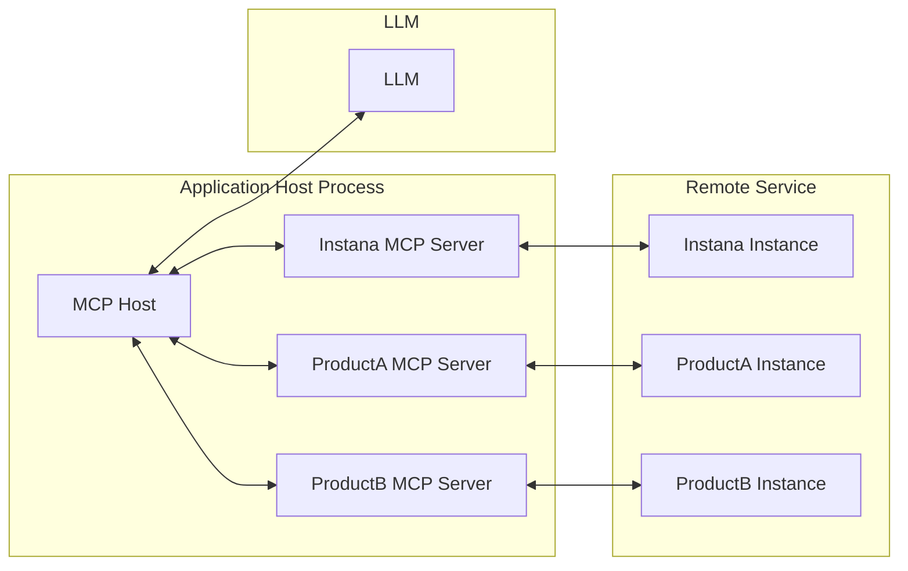
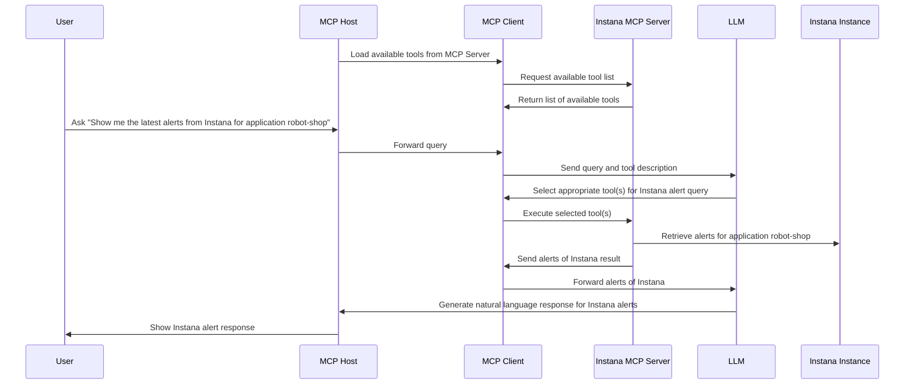
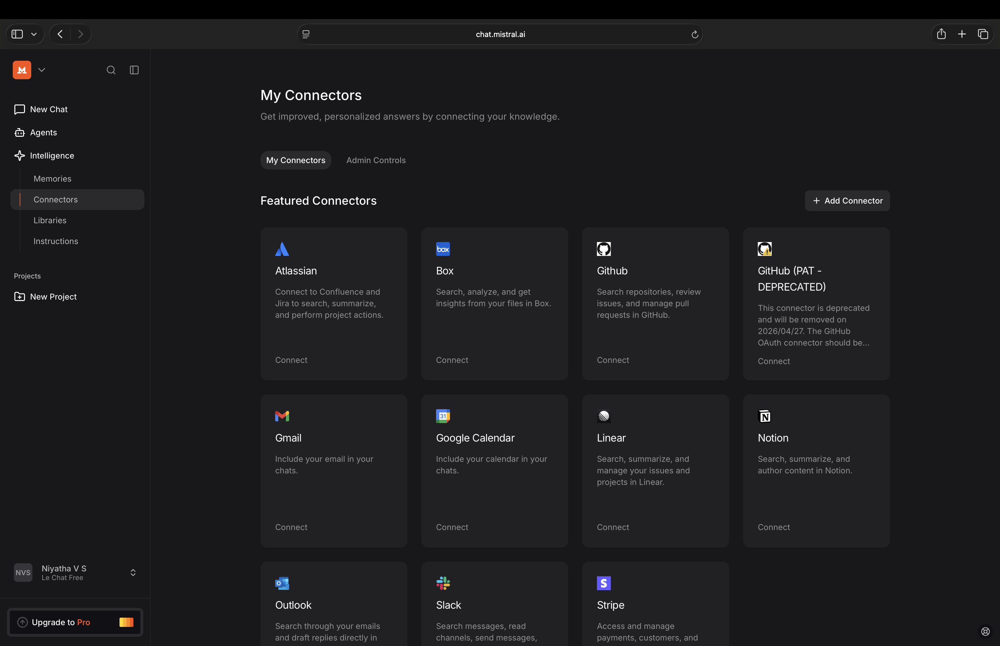
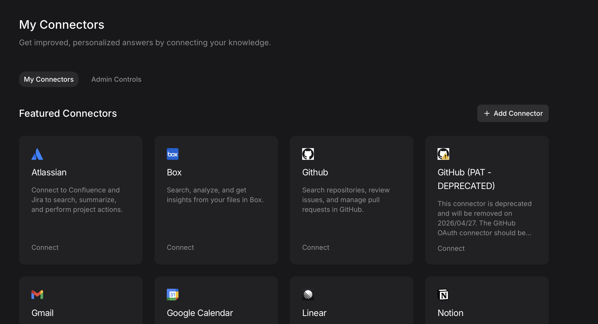
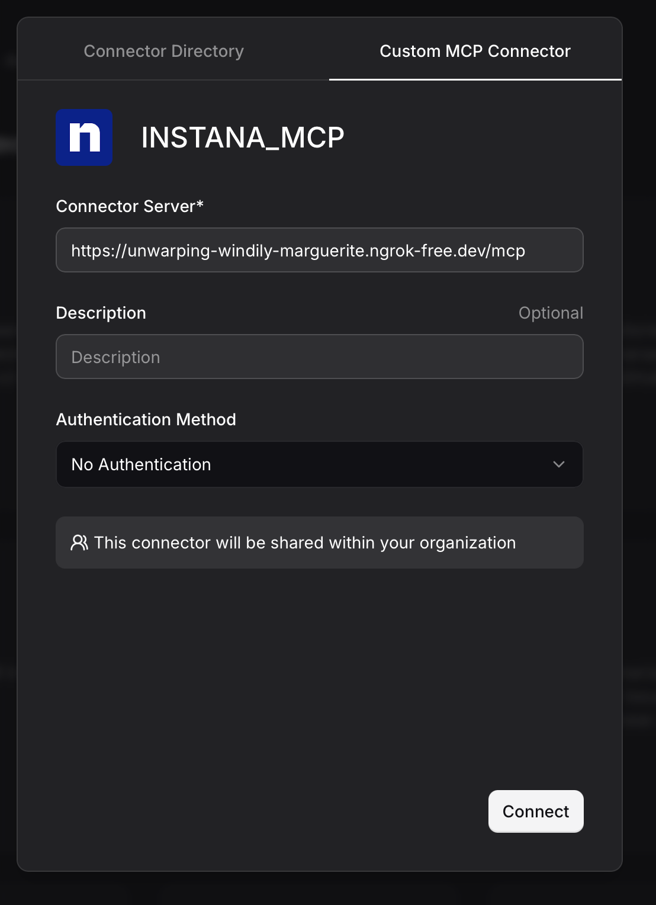
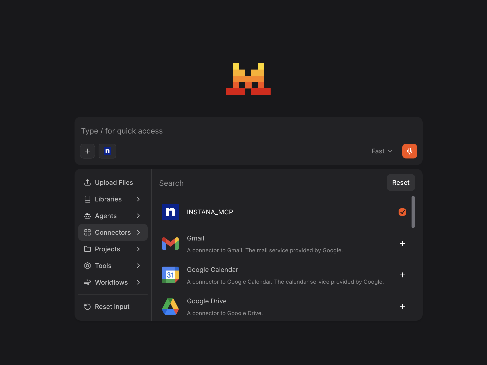
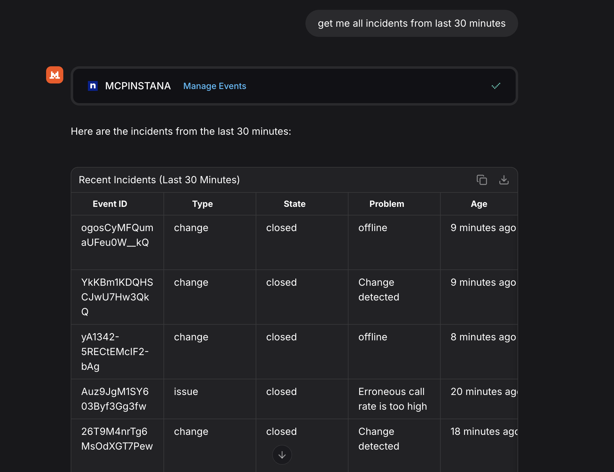

<!-- START doctoc generated TOC please keep comment here to allow auto update -->
<!-- DON'T EDIT THIS SECTION, INSTEAD RE-RUN doctoc TO UPDATE -->
## Table of Contents

- [MCP Server for IBM Instana](#mcp-server-for-ibm-instana)
  - [📚 Quick Links](#-quick-links)
  - [Architecture Overview](#architecture-overview)
  - [Workflow](#workflow)
  - [Prerequisites](#prerequisites)
    - [Option 1: Install from PyPI (Recommended)](#option-1-install-from-pypi-recommended)
    - [Option 2: Development Installation](#option-2-development-installation)
      - [Installing uv](#installing-uv)
      - [Setting Up the Environment](#setting-up-the-environment)
    - [Header-Based Authentication for Streamable HTTP Mode](#header-based-authentication-for-streamable-http-mode)
      - [1. API Token Authentication (Direct API Calls)](#1-api-token-authentication-direct-api-calls)
      - [2. Session Token Authentication (UI-Initiated Calls)](#2-session-token-authentication-ui-initiated-calls)
  - [Starting the Local MCP Server](#starting-the-local-mcp-server)
    - [Server Command Options](#server-command-options)
      - [Using the CLI (PyPI Installation)](#using-the-cli-pypi-installation)
      - [Using Development Installation](#using-development-installation)
    - [Starting in Streamable HTTP Mode](#starting-in-streamable-http-mode)
      - [Using CLI (PyPI Installation)](#using-cli-pypi-installation)
      - [Using Development Installation](#using-development-installation-1)
    - [Starting in Stdio Mode](#starting-in-stdio-mode)
      - [Using CLI (PyPI Installation)](#using-cli-pypi-installation-1)
      - [Using Development Installation](#using-development-installation-2)
    - [Tool Categories](#tool-categories)
      - [Using CLI (PyPI Installation)](#using-cli-pypi-installation-2)
      - [Using Development Installation](#using-development-installation-3)
    - [Verifying Server Status](#verifying-server-status)
    - [Common Startup Issues](#common-startup-issues)
  - [Setup and Usage](#setup-and-usage)
    - [Claude Desktop](#claude-desktop)
      - [Streamable HTTP Mode](#streamable-http-mode)
      - [Stdio Mode](#stdio-mode)
    - [Kiro Setup](#kiro-setup)
      - [Streamable HTTP Mode (Recommended for Kiro)](#streamable-http-mode-recommended-for-kiro)
      - [Stdio Mode](#stdio-mode-1)
    - [GitHub Copilot](#github-copilot)
      - [Streamable HTTP Mode](#streamable-http-mode-1)
      - [Stdio Mode](#stdio-mode-2)
    - [Mistral AI](#mistral-ai)
  - [Supported Features](#supported-features)
  - [Available Tools](#available-tools)
  - [Tool Filtering](#tool-filtering)
    - [Available Tool Categories](#available-tool-categories)
    - [Usage Examples](#usage-examples)
      - [Using CLI (PyPI Installation)](#using-cli-pypi-installation-3)
      - [Using Development Installation](#using-development-installation-4)
    - [Benefits of Tool Filtering](#benefits-of-tool-filtering)
  - [Docker Deployment](#docker-deployment)
    - [Docker Architecture](#docker-architecture)
      - [**pyproject.toml** (Development)](#pyprojecttoml-development)
      - [**pyproject-runtime.toml** (Production)](#pyproject-runtimetoml-production)
    - [Building the Docker Image](#building-the-docker-image)
      - [**Prerequisites**](#prerequisites)
      - [**Build Command**](#build-command)
  - [Troubleshooting](#troubleshooting)
    - [**Docker Issues**](#docker-issues)
      - [**Container Won't Start**](#container-wont-start)
      - [**Connection Issues**](#connection-issues)
      - [**Performance Issues**](#performance-issues)
    - [**General Issues**](#general-issues)

<!-- END doctoc generated TOC please keep comment here to allow auto update -->

# MCP Server for IBM Instana

## 📚 Quick Links

- **[Tools & Examples](docs/TOOLS_AND_EXAMPLES.md)** - Comprehensive tool documentation with real-world examples
- **[Privacy Policy](docs/PRIVACY.md)** - Data handling and privacy information
- **[Docker Deployment Guide](DOCKER.md)** - Comprehensive Docker deployment, multi-architecture builds, and production setup

---

The Instana MCP server enables seamless interaction with the Instana observability platform, allowing you to access real-time observability data directly within your development workflow.

It serves as a bridge between clients (such as AI agents or custom tools) and the Instana REST APIs, converting user queries into Instana API requests and formatting the responses into structured, easily consumable formats.

The server supports both **Streamable HTTP** and **Stdio** transport modes for maximum compatibility with different MCP clients. For more details, refer to the [MCP Transport Modes specification](https://modelcontextprotocol.io/specification/2025-06-18/basic/transports).

## Architecture Overview



## Workflow

Consider a simple example: You're using an MCP Host (such as Claude Desktop, VS Code, or another client) connected to the Instana MCP Server. When you request information about Instana alerts, the following process occurs:

1. The MCP client retrieves the list of available tools from the Instana MCP server
2. Your query is sent to the LLM along with tool descriptions
3. The LLM analyzes the available tools and selects the appropriate one(s) for retrieving Instana alerts
4. The client executes the chosen tool(s) through the Instana MCP server
5. Results (latest alerts) are returned to the LLM
6. The LLM formulates a natural language response
7. The response is displayed to you



## Prerequisites

### Option 1: Install from PyPI (Recommended)

The easiest way to use mcp-instana is to install it directly from PyPI:

```shell
pip install mcp-instana
```

After installation, you can run the server using the `mcp-instana` command directly.

### Option 2: Development Installation

For development or local customization, you can clone and set up the project locally.

#### Installing uv

This project uses `uv`, a fast Python package installer and resolver. To install `uv`, you have several options:

**Using pip:**
```shell
pip install uv
```

**Using Homebrew (macOS):**
```shell
brew install uv
```

For more installation options and detailed instructions, visit the [uv documentation](https://github.com/astral-sh/uv).

#### Setting Up the Environment

After installing `uv`, set up the project environment by running:

```shell
uv sync
```

### Header-Based Authentication for Streamable HTTP Mode

When using **Streamable HTTP mode**, you must pass Instana credentials via HTTP headers. This approach enhances security and flexibility by:

- Avoiding credential storage in environment variables
- Enabling the use of different credentials for different requests
- Supporting shared environments where environment variable modification is restricted
- Supporting both API token and session-based authentication

**Supported Authentication Modes:**

#### 1. API Token Authentication (Direct API Calls)
**Required Headers:**
- `instana-base-url`: Your Instana instance URL
- `instana-api-token`: Your Instana API token

**Example:**
```bash
--header "instana-base-url: https://your-instance.instana.io"
--header "instana-api-token: your-api-token"
```

#### 2. Session Token Authentication (UI-Initiated Calls)
**Required Headers:**
- `instana-base-url`: Your Instana instance URL
- `instana-auth-token`: Session authentication token from UI backend
- `instana-csrf-token`: CSRF token from UI backend
- `instana-cookie-name`: (Optional) Cookie name for session auth (default: `instanaAuthToken`)

**Example:**
```bash
--header "instana-base-url: https://your-instance.instana.io"
--header "instana-auth-token: your-session-token"
--header "instana-csrf-token: your-csrf-token"
--header "instana-cookie-name: in-token"
```

**Authentication Priority:**
1. **API Token** (if provided) - Takes precedence
2. **Session Tokens** (if both auth_token and csrf_token provided)
3. **Environment Variable** (`INSTANA_API_TOKEN`) - Fallback

**Authentication Flow:**
1. HTTP headers must be present in each request
2. Server validates credentials based on priority order
3. Requests without valid authentication will fail

This design ensures secure credential transmission and supports multiple authentication flows including UI-initiated calls via WebSocket → Coordinator → MCP Server.

## Starting the Local MCP Server

Before configuring any MCP client (Claude Desktop, GitHub Copilot, or custom MCP clients), you need to start the local MCP server. The server supports two transport modes: **Streamable HTTP** and **Stdio**.

### Server Command Options

#### Using the CLI (PyPI Installation)

If you installed mcp-instana from PyPI, use the `mcp-instana` command:

```bash
mcp-instana [OPTIONS]
```

#### Using Development Installation

For local development, use the `uv run` command:

```bash
uv run src/core/server.py [OPTIONS]
```

**Available Options:**
- `--transport <mode>`: Transport mode (choices: `streamable-http`, `stdio`)
- `--env KEY=VALUE`: Set environment variable (can be repeated for multiple variables, e.g., `--env INSTANA_BASE_URL=https://... --env INSTANA_API_TOKEN=...`)
- `--debug`: Enable debug mode with additional logging
- `--log-level <level>`: Set the logging level (choices: `DEBUG`, `INFO`, `WARNING`, `ERROR`, `CRITICAL`)
- `--tools <categories>`: Comma-separated list of tool categories to enable (e.g., infra,app,events,website). Enabling a category will also enable its related prompts. For example: `--tools infra` enables the infra tools and all infra-related prompts.
- `--list-tools`: List all available tool categories and exit
- `--port <port>`: MCP server port (default: 8080, can be overridden with PORT env var)
- `--help`: Show help message and exit

### Starting in Streamable HTTP Mode

**Streamable HTTP mode** provides a REST API interface and is recommended for most use cases.

#### Using CLI (PyPI Installation)

```bash
# Start with all tools enabled (default)
mcp-instana --transport streamable-http

# Start with debug logging
mcp-instana --transport streamable-http --debug

# Start with a specific log level
mcp-instana --transport streamable-http --log-level WARNING

# Start with specific tool categories only
mcp-instana --transport streamable-http --tools infra,events

# Combine options (specific log level, custom tools)
mcp-instana --transport streamable-http --log-level DEBUG --tools app,events
```

#### Using Development Installation

```bash
# Start with all tools enabled (default)
uv run src/core/server.py --transport streamable-http

# Start with debug logging
uv run src/core/server.py --transport streamable-http --debug

# Start with a specific log level
uv run src/core/server.py --transport streamable-http --log-level WARNING

# Start with specific tool and prompts categories only
uv run src/core/server.py --transport streamable-http --tools infra,events

# Start with custom port
uv run src/core/server.py --transport streamable-http --port 9000

# Combine options (specific log level, custom tools and prompts)
uv run src/core/server.py --transport streamable-http --log-level DEBUG --tools app,events
```

**Key Features of Streamable HTTP Mode:**
- Uses HTTP headers for authentication (no environment variables needed)
- Supports different credentials per request
- Better suited for shared environments
- MCP server default port: 8080
- MCP endpoint: `http://0.0.0.0:8080/mcp/`

### Starting in Stdio Mode

**Stdio mode** uses standard input/output for communication and requires environment variables for authentication.

#### Using CLI (PyPI Installation)

```bash
# Option 1: Set environment variables first
export INSTANA_BASE_URL="https://your-instana-instance.instana.io"
export INSTANA_API_TOKEN="your_instana_api_token"

# Start the server (stdio is the default if no transport specified)
mcp-instana

# Or explicitly specify stdio mode
mcp-instana --transport stdio

# Option 2: Use --env flag to set environment variables directly
mcp-instana --env INSTANA_BASE_URL=https://your-instana-instance.instana.io --env INSTANA_API_TOKEN=your_instana_api_token

# Or with explicit stdio mode
mcp-instana --transport stdio --env INSTANA_BASE_URL=https://your-instana-instance.instana.io --env INSTANA_API_TOKEN=your_instana_api_token
```

#### Using Development Installation

```bash
# Option 1: Set environment variables first
export INSTANA_BASE_URL="https://your-instana-instance.instana.io"
export INSTANA_API_TOKEN="your_instana_api_token"

# Start the server (stdio is the default if no transport specified)
uv run src/core/server.py

# Or explicitly specify stdio mode
uv run src/core/server.py --transport stdio

# Option 2: Use --env flag to set environment variables directly
uv run src/core/server.py --env INSTANA_BASE_URL=https://your-instana-instance.instana.io --env INSTANA_API_TOKEN=your_instana_api_token

# Or with explicit stdio mode
uv run src/core/server.py --transport stdio --env INSTANA_BASE_URL=https://your-instana-instance.instana.io --env INSTANA_API_TOKEN=your_instana_api_token
```

**Key Features of Stdio Mode:**
- Uses environment variables for authentication (can be set via `export` or `--env` flag)
- Direct communication via stdin/stdout
- Required for certain MCP client configurations
- The `--env` flag provides a convenient way to set credentials without modifying shell environment

### Tool Categories

You can optimize server performance by enabling only the tools and prompts categories you need:

#### Using CLI (PyPI Installation)

```bash
# List all available categories
mcp-instana --list-tools

# Enable specific categories
mcp-instana --transport streamable-http --tools infra,app
mcp-instana --transport streamable-http --tools events
```

#### Using Development Installation

```bash
# List all available categories
uv run src/core/server.py --list-tools

# Enable specific categories
uv run src/core/server.py --transport streamable-http --tools infra,app
uv run src/core/server.py --transport streamable-http --tools events
```

**Available Categories:**
- **`infra`**: Infrastructure monitoring tools and prompts (resources, catalog, topology, analyze, metrics)
- **`app`**: Application performance tools and prompts (resources, metrics, alerts, catalog, topology, analyze, settings, global alerts)
- **`events`**: Event monitoring tools and prompts (Kubernetes events, agent monitoring)
- **`website`**: Website monitoring tools and prompts (metrics, catalog, analyze, configuration)

### Verifying Server Status

Once started, you can verify the server is running:

**For Streamable HTTP mode:**
```bash
# Check MCP server
curl http://0.0.0.0:8080/mcp/

# Or with custom port
curl http://0.0.0.0:9000/mcp/
```

**For Stdio mode:**
The server will start and wait for stdin input from MCP clients.

### Common Startup Issues

**Certificate Issues:**
If you encounter SSL certificate errors, ensure your Python environment has access to system certificates:
```bash
# macOS - Install certificates for Python
/Applications/Python\ 3.13/Install\ Certificates.command
```

**Port Already in Use:**
If port 8080 is already in use, specify a different port:
```bash
uv run src/core/server.py --transport streamable-http --port 9000
```

**Missing Dependencies:**
Ensure all dependencies are installed:
```bash
uv sync
```

## Setup and Usage

### Claude Desktop

Claude Desktop supports both Streamable HTTP and Stdio modes for MCP integration.

Configure Claude Desktop by editing the configuration file:

**File Locations:**
- **macOS**: `~/Library/Application Support/Claude/claude_desktop_config.json`
- **Windows**: `%APPDATA%\Claude\claude_desktop_config.json`

#### Streamable HTTP Mode

The Streamable HTTP mode provides a REST API interface for MCP communication using JSON-RPC over HTTP.

**Step 1: Start the MCP Server in Streamable HTTP Mode**

Before configuring Claude Desktop, you need to start the MCP server in Streamable HTTP mode. Please refer to the [Starting the Local MCP Server](#starting-the-local-mcp-server) section for detailed instructions.

**Step 2: Configure Claude Desktop**

Configure Claude Desktop to pass Instana credentials via headers:

```json:claude_desktop_config.json
{
  "mcpServers": {
    "Instana MCP Server": {
      "command": "npx",
      "args": [
        "mcp-remote", "http://0.0.0.0:8080/mcp/",
        "--allow-http",
        "--header", "instana-base-url: https://your-instana-instance.instana.io",
        "--header", "instana-api-token: your_instana_api_token"
      ]
    }
  }
}
```

**Note:** To use npx, we recommend first installing NVM (Node Version Manager), then using it to install Node.js.
Installation instructions are available at: https://nodejs.org/en/download

**Step 3: Test the Connection**

Restart Claude Desktop. You should now see Instana MCP Server in the Claude Desktop interface as shown below:


You can now run queries in Claude Desktop:

```
get me all endpoints from Instana
```


#### Stdio Mode

**Configuration using CLI (PyPI Installation - Recommended):**

**Option 1: Using environment variables in config:**
```json
{
  "mcpServers": {
    "Instana MCP Server": {
      "command": "mcp-instana",
      "args": ["--transport", "stdio"],
      "env": {
        "INSTANA_BASE_URL": "https://your-instana-instance.instana.io",
        "INSTANA_API_TOKEN": "your_instana_api_token"
      }
    }
  }
}
```

**Option 2: Using --env flag (alternative method):**
```json
{
  "mcpServers": {
    "Instana MCP Server": {
      "command": "mcp-instana",
      "args": [
        "--transport", "stdio",
        "--env", "INSTANA_BASE_URL=https://your-instana-instance.instana.io",
        "--env", "INSTANA_API_TOKEN=your_instana_api_token"
      ]
    }
  }
}
```

**Note:** If you encounter "command not found" errors, use the full path to mcp-instana. Find it with `which mcp-instana` and use that path instead.

**Configuration using Development Installation:**

**Option 1: Using environment variables in config:**
```json
{
  "mcpServers": {
    "Instana MCP Server": {
      "command": "uv",
      "args": [
        "--directory",
        "<path-to-mcp-instana-folder>",
        "run",
        "src/core/server.py"
      ],
      "env": {
        "INSTANA_BASE_URL": "https://your-instana-instance.instana.io",
        "INSTANA_API_TOKEN": "your_instana_api_token"
      }
    }
  }
}
```

**Option 2: Using --env flag (alternative method):**
```json
{
  "mcpServers": {
    "Instana MCP Server": {
      "command": "uv",
      "args": [
        "--directory",
        "<path-to-mcp-instana-folder>",
        "run",
        "src/core/server.py",
        "--env", "INSTANA_BASE_URL=https://your-instana-instance.instana.io",
        "--env", "INSTANA_API_TOKEN=your_instana_api_token"
      ]
    }
  }
}
```
### Kiro Setup

Kiro is an agentic IDE, not an extension that can be downloaded into VS Code or some other IDE.

**Step 1: Download and install Kiro for your operating system from https://kiro.dev/.**

**Step 2: After installation, launch Kiro and open any project in the IDE.**


**Step 3: Click the Kiro (Ghost) icon on the left sidebar to access Kiro's features.**


**Step 4: Select the Edit Config icon in the top right corner of the MCP Servers section.**


**Step 5: Open the MCP server configuration file (mcp.json) and configure it based on your preferred transport mode:**

#### Streamable HTTP Mode (Recommended for Kiro)

```json
{
  "mcpServers": {
    "Instana MCP Server": {
      "command": "npx",
      "args": [
        "mcp-remote", "http://0.0.0.0:8080/mcp/",
        "--allow-http",
        "--header", "instana-base-url: https://your-instana-instance.instana.io",
        "--header", "instana-api-token: your_instana_api_token"
      ]
    }
  }
}
```

**Note:** Make sure to start the MCP server in streamable-http mode before using this configuration:
```bash
mcp-instana --transport streamable-http
```

#### Stdio Mode

**Option 1: Using environment variables in config:**
```json
{
  "mcpServers": {
    "Instana MCP Server": {
      "command": "mcp-instana",
      "args": ["--transport", "stdio"],
      "env": {
        "INSTANA_BASE_URL": "https://your-instana-instance.instana.io",
        "INSTANA_API_TOKEN": "your_instana_api_token"
      }
    }
  }
}
```

**Option 2: Using --env flag (alternative method):**
```json
{
  "mcpServers": {
    "Instana MCP Server": {
      "command": "mcp-instana",
      "args": [
        "--transport", "stdio",
        "--env", "INSTANA_BASE_URL=https://your-instana-instance.instana.io",
        "--env", "INSTANA_API_TOKEN=your_instana_api_token"
      ]
    }
  }
}
```

**Step 6: After saving the file, Click the Enable MCP button and you'll see your MCP server and its available tools appear in the bottom-left section of Kiro.**


**Step 7: Go to the AI Chat panel, enter a prompt related to your MCP server, and view the response directly within Kiro.**


### GitHub Copilot

GitHub Copilot supports MCP integration through VS Code configuration.
For GitHub Copilot integration with VS Code, refer to this [setup guide](https://code.visualstudio.com/docs/copilot/setup).

#### Streamable HTTP Mode

**Step 1: Start the MCP Server in Streamable HTTP Mode**

Before configuring VS Code, you need to start the MCP server in Streamable HTTP mode. Please refer to the [Starting the Local MCP Server](#starting-the-local-mcp-server) section for detailed instructions.

**Step 2: Configure VS Code**

Refer to [Use MCP servers in VS Code](https://code.visualstudio.com/docs/copilot/chat/mcp-servers) for detailed configuration.

You can directly create or update `.vscode/mcp.json` with the following configuration:

```json:.vscode/mcp.json
{
  "servers": {
    "Instana MCP Server": {
      "command": "npx",
      "args": [
        "mcp-remote", "http://0.0.0.0:8080/mcp/",
        "--allow-http",
        "--header", "instana-base-url: https://your-instana-instance.instana.io",
        "--header", "instana-api-token: your_instana_api_token"
      ],
      "env": {
        "PATH": "/usr/local/bin:/bin:/usr/bin",
        "SHELL": "/bin/sh"
      }
    }
  }
}
```

**Note:** Replace the following values with your actual configuration:
- `instana-base-url`: Your Instana instance URL
- `instana-api-token`: Your Instana API token
- `command`: Update the npx path to match your system's Node.js installation (e.g., `/path/to/your/node/bin/npx`)
- Environment variables: Adjust PATH and other environment variables as needed for your system


#### Stdio Mode

**Step 1: Create VS Code MCP Configuration**

**Using CLI (PyPI Installation - Recommended):**

Create `.vscode/mcp.json` in your project root:

**Option 1: Using environment variables in config:**
```json:.vscode/mcp.json
{
  "servers": {
    "Instana MCP Server": {
      "command": "mcp-instana",
      "args": ["--transport", "stdio"],
      "env": {
        "INSTANA_BASE_URL": "https://your-instana-instance.instana.io",
        "INSTANA_API_TOKEN": "your_instana_api_token"
      }
    }
  }
}
```

**Option 2: Using --env flag (alternative method):**
```json:.vscode/mcp.json
{
  "servers": {
    "Instana MCP Server": {
      "command": "mcp-instana",
      "args": [
        "--transport", "stdio",
        "--env", "INSTANA_BASE_URL=https://your-instana-instance.instana.io",
        "--env", "INSTANA_API_TOKEN=your_instana_api_token"
      ]
    }
  }
}
```

**Using Development Installation:**

Create `.vscode/mcp.json` in your project root:

**Option 1: Using environment variables in config:**
```json:.vscode/mcp.json
{
  "servers": {
    "Instana MCP Server": {
      "command": "uv",
      "args": [
        "--directory",
        "/absolute/path/to/your/project/mcp-instana",
        "run",
        "src/core/server.py"
      ],
      "env": {
        "INSTANA_BASE_URL": "https://your-instana-instance.instana.io",
        "INSTANA_API_TOKEN": "your_instana_api_token"
      }
    }
  }
}
```

**Option 2: Using --env flag (alternative method):**
```json:.vscode/mcp.json
{
  "servers": {
    "Instana MCP Server": {
      "command": "uv",
      "args": [
        "--directory",
        "/absolute/path/to/your/project/mcp-instana",
        "run",
        "src/core/server.py",
        "--env", "INSTANA_BASE_URL=https://your-instana-instance.instana.io",
        "--env", "INSTANA_API_TOKEN=your_instana_api_token"
      ]
    }
  }
}
```

**Note:** Replace the following values with your actual configuration:
- For CLI installation: Ensure `mcp-instana` is in your PATH
- For development installation: 
  - `command`: Update the uv path to match your system's uv installation (e.g., `/path/to/your/uv/bin/uv` or `/usr/local/bin/uv`)
  - `--directory`: Update with the absolute path to your mcp-instana project directory
- `INSTANA_BASE_URL`: Your Instana instance URL
- `INSTANA_API_TOKEN`: Your Instana API token

**Step 2: Manage Server in VS Code**

1. **Open `.vscode/mcp.json`** - you'll see server management controls at the top
2. **Click `Start`** next to `Instana MCP Server` to start the server
3. Running status along with the number of tools indicates the server is running

**Step 3: Test Integration**

Switch to Agent Mode in GitHub Copilot and reload tools.
Here is an example of a GitHub Copilot response:


### Mistral AI

Mistral AI supports MCP integration exclusively through Streamable HTTP mode.

**Step 1: Launch the MCP Server in Streamable HTTP Mode**

Start the MCP server in Streamable HTTP mode by providing your Instana credentials. Run the following command:

```bash
uv run src/core/server.py --transport streamable-http \
  --api-token "your_instana_api_token" \
  --base-url "https://your-instana-instance.instana.io" \
  --port 8080
```

**Step 2: Set Up Port Forwarding with Ngrok**

Configure port forwarding to expose your local server. Follow the [Ngrok setup documentation](https://dashboard.ngrok.com/get-started/setup/macos) for detailed instructions.

**Step 3: Configure Mistral AI**

1. Navigate to the **Intelligence** tab in the left sidebar and select **Connectors**
   

2. Click **Add Connector**
   

3. Create a custom connector by entering a connector name and the Ngrok-forwarded MCP server URL
   

4. Start a new chat session and verify that MCP tools are enabled. You can view the response here
   
   


## Supported Features

- [x] **Unified Application & Infrastructure Management** (`manage_instana_resources`)
  - [x] Application Metrics
    - [x] Query application metrics with flexible filtering
    - [x] List services and endpoints
    - [x] Group by tags and aggregate metrics
  - [x] Application Alert Configuration
    - [x] Find active alert configurations
    - [x] Get alert configuration versions
    - [x] Create, update, and delete alert configurations
    - [x] Enable, disable, and restore alert configurations
    - [x] Update historic baselines
  - [x] Global Application Alert Configuration
    - [x] Manage global alert configurations
    - [x] Version control for global alerts
  - [x] Application Settings
    - [x] Manage application perspectives
    - [x] Configure endpoints and services
    - [x] Manage manual services
  - [x] Application Catalog
    - [x] Get application tag catalog
    - [x] Get application metric catalog
- [x] **Infrastructure Analysis** (`analyze_infrastructure`)
  - [x] Two-pass elicitation for entity/metric queries
  - [x] Dynamic support for all entity types from Instana API catalog (JVM, Kubernetes, Docker, hosts, databases, message queues, and more)
  - [x] Automatically synchronized with your Instana installation's available plugins
  - [x] Flexible metric aggregation (max, mean, sum, etc.)
  - [x] Advanced filtering by tags and properties
  - [x] Grouping and ordering capabilities
  - [x] Time range queries
- [x] **Unified Events Management** (`manage_events`)
  - [x] Events Monitoring
    - [x] Get Event by ID (operation="get_event")
    - [x] Get Events by IDs (operation="get_events_by_ids")
    - [x] Get Agent Monitoring Events (operation="get_agent_monitoring_events")
    - [x] Get Kubernetes Info Events (operation="get_kubernetes_info_events")
    - [x] Get Events (operation="get_events")
  - [x] Smart routing to specialized event tools
  - [x] Unified parameter validation (time ranges, max_events)
  - [x] Support for natural language time ranges ("last 24 hours", "last 2 days")
  - [x] Event filtering and optimization
- [x] **Unified Website Management** (`manage_website_resources`)
  - [x] Website Analyze (resource_type="analyze")
    - [x] Get Website Beacon Groups - grouped/aggregated beacon data (operation="get_beacon_groups")
    - [x] Get Website Beacons - individual beacon data with pagination (operation="get_beacons")
    - [x] Automatic tag validation and catalog-based elicitation workflow
    - [x] Response summarization (70-80% payload reduction)
    - [x] Support for multiple beacon types: PAGELOAD, PAGECHANGE, RESOURCELOAD, CUSTOM, HTTPREQUEST, ERROR
  - [x] Website Catalog (resource_type="catalog")
    - [x] Get Website Metrics Catalog (operation="get_metrics")
    - [x] Get Website Tag Catalog by beacon type and use case (operation="get_tag_catalog")
  - [x] Website Configuration (resource_type="configuration")
    - [x] Get All Websites (operation="get_all")
    - [x] Get Website by ID or name with automatic name resolution (operation="get")
  - [x] Advanced Configuration - READ ONLY (resource_type="advanced_config")
    - [x] Get Geo-Location Configuration (operation="get_geo_config")
    - [x] Get IP Masking Configuration (operation="get_ip_masking")
    - [x] Get Geo Mapping Rules (operation="get_geo_rules")
- [x] **Unified Automation Management** (`manage_automation`)
  - [x] Action Catalog (resource_type="catalog")
    - [x] List all available automation actions (operation="get_actions")
    - [x] Get detailed information about a specific action (operation="get_action_details")
    - [x] Search for matching actions by name/description (operation="get_action_matches")
    - [x] Get action matches by application or snapshot ID and time window (operation="get_action_matches_by_id_and_time_window")
    - [x] Get available action types (operation="get_action_types")
    - [x] Get available action tags (operation="get_action_tags")
  - [x] Action History (resource_type="history")
    - [x] List action execution instances with filtering (operation="list")
    - [x] Get details of a specific action execution (operation="get_details")
- [x] **Custom Dashboards** (`manage_custom_dashboards`)
  - [x] Get all custom dashboards
  - [x] Get specific dashboard by ID
  - [x] Create new custom dashboard
  - [x] Update existing custom dashboard
  - [x] Delete custom dashboard
  - [x] Get shareable users for dashboard
  - [x] Get shareable API tokens for dashboard

## Available Tools

| Tool                                                          | Category                       | Description                                            |
|---------------------------------------------------------------|--------------------------------|------------------------------------------------------- |
| `manage_applications`                                         | Application & Infrastructure   | Unified tool for managing application metrics, alert configs, settings, and catalog |
| `manage_websites`                                             | Website Monitoring             | Unified smart router for website analyze, catalog, configuration, and advanced config operations |
| `manage_custom_dashboards`                                    | Custom Dashboards              | Unified tool for managing custom dashboard CRUD operations |
| `analyze_infrastructure`                                      | Infrastructure Analyze         | Two-pass infrastructure analysis with entity/metric elicitation |
| `manage_automation`                                           | Automation                     | Unified smart router for automation: browse action catalog and view execution history |
| `manage_events`                                               | Events                         | Unified smart router for events monitoring: get event by ID, get events by IDs, Kubernetes events, agent monitoring events and all events |
| `manage_slo`                                                  | SLO Management                 | Unified smart router for SLO configurations, reports, alerts, and correction windows with intelligent timezone handling |
| `manage_releases`                                             | Release Management             | Unified smart router for release tracking: list releases with pagination and name filtering, get release details, create/update/delete releases with timezone support |

👉 **For detailed tool documentation, capabilities, and technical reference, see [Tools & Examples](docs/TOOLS_AND_EXAMPLES.md)**

## Tool Filtering

The MCP server supports selective tool loading to optimize performance and reduce resource usage. You can enable only the tool categories you need for your specific use case.

### Available Tool Categories

- **`router`**: Unified application and infrastructure management
  - `manage_instana_resources`: Single tool for application metrics, alert configurations, settings, and catalog
  - Supports application perspectives, endpoints, services, and manual services
  - Manages both application-specific and global alert configurations
  - Provides access to application tag catalog and metric catalog

- **`dashboard`**: Custom dashboard management
  - `manage_custom_dashboards`: CRUD operations for custom dashboards
  - Supports dashboard creation, retrieval, updates, and deletion
  - Manages shareable users and API tokens for dashboards

- **`infra`**: Infrastructure analysis tools
  - `analyze_infrastructure`: Two-pass infrastructure analysis with entity/metric elicitation
  - Dynamically supports all entity types available in your Instana installation (automatically loaded from API catalog)
  - Includes JVM, Kubernetes, Docker, hosts, databases, message queues, and any custom or newly added entity types
  - Flexible metric aggregation, filtering, grouping, and time range queries

- **`automation`**: Automation action tools
  - `manage_automation`: Unified smart router for automation catalog and execution history
  - Action Catalog: browse actions, get details, search by name/description, filter by application or snapshot ID
  - Action History: list execution instances with filtering, get execution details

- **`events`**: Event monitoring tools
  - Events: Kubernetes events, agent monitoring and system event tracking

- **`website`**: Website monitoring tools
  - Website Metrics: Performance measurement for websites
  - Website Catalog: Website metadata and definitions
  - Website Analyze: Website performance analysis
  - Website Configuration: Website configuration management

- **`slo`**: Service Level Objective (SLO) management
  - `manage_slo`: Unified smart router for comprehensive SLO operations
  - **Configuration Management**: Create, read, update, delete SLO configurations with support for time-based and event-based indicators
  - **Report Generation**: Generate detailed SLO reports with SLI values, error budgets, burn rates, and time-series charts
  - **Alert Configuration**: Manage SLO alert configs for error budget monitoring and burn rate tracking
  - **Correction Windows**: Create and manage maintenance windows to exclude planned downtime from SLO calculations
  - **Intelligent Timezone Handling**: Automatic timezone elicitation for datetime inputs to ensure accurate time context
  - **Two-Pass Elicitation**: Interactive parameter gathering for complex operations requiring multiple inputs

- **`releases`**: Release tracking and deployment management
  - `manage_releases`: Unified smart router for release operations
  - **List Releases**: Get all releases with efficient pagination (page_number, page_size) and name-based filtering
  - **Release Details**: Retrieve specific release information by ID including applications, services, and scopes
  - **Create/Update/Delete**: Full CRUD operations for release management
  - **Intelligent Timezone Handling**: Automatic timezone elicitation for release start times
  - **Efficient Pagination**: Avoid redundant data fetching with proper page-based navigation
  - **Name Filtering**: Case-insensitive substring matching to find releases by name

### Usage Examples

#### Using CLI (PyPI Installation)

```bash
# Enable only router (unified app/infra management) and events tools
mcp-instana --tools router,events --transport streamable-http

# Enable only infrastructure analysis tools
mcp-instana --tools infra --transport streamable-http

# Enable router and infrastructure analysis
mcp-instana --tools router,infra --transport streamable-http

# Enable events and website tools
mcp-instana --tools events,website --transport streamable-http

# Enable dashboard and router tools
mcp-instana --tools dashboard,router --transport streamable-http

# Enable releases and events tools
mcp-instana --tools releases,events --transport streamable-http

# Enable all tools (default behavior)
mcp-instana --transport streamable-http

# List all available tool categories and their tools
mcp-instana --list-tools
```

#### Using Development Installation

```bash
# Enable only router (unified app/infra management) and events tools
uv run src/core/server.py --tools router,events --transport streamable-http

# Enable only infrastructure analysis tools
uv run src/core/server.py --tools infra --transport streamable-http

# Enable router and infrastructure analysis
uv run src/core/server.py --tools router,infra --transport streamable-http

# Enable events and website tools
uv run src/core/server.py --tools events,website --transport streamable-http

# Enable dashboard and router tools
uv run src/core/server.py --tools dashboard,router --transport streamable-http

# Enable releases and events tools
uv run src/core/server.py --tools releases,events --transport streamable-http

# Enable all tools (default behavior)
uv run src/core/server.py --transport streamable-http

# List all available tool categories and their tools
uv run src/core/server.py --list-tools
```

### Benefits of Tool Filtering

- **Performance**: Reduced startup time and memory usage
- **Security**: Limit exposure to only necessary APIs
- **Clarity**: Focus on specific use cases (e.g., only infrastructure monitoring)
- **Resource Efficiency**: Lower CPU and network usage

👉 **For usage examples and prompts, see [Example Prompts](docs/TOOLS_AND_EXAMPLES.md)**

## Docker Deployment

The MCP Instana server can be deployed using Docker for production environments. The Docker setup is optimized for security, performance, and minimal resource usage.

### Docker Architecture

The project uses a **two-file dependency management strategy**:

#### **pyproject.toml** (Development)
- **Purpose**: Full development environment with all tools
- **Dependencies**: 20 essential + 8 development dependencies (pytest, ruff, coverage, etc.)
- **Usage**: Local development, testing, and CI/CD
- **Size**: Larger but includes all development tools

#### **pyproject-runtime.toml** (Production)
- **Purpose**: Minimal production runtime dependencies only
- **Dependencies**: 20 essential dependencies only
- **Usage**: Docker production builds
- **Size**: Optimized for minimal image size and security

### Building the Docker Image

#### **Prerequisites**
- Docker installed and running
- Access to the project source code
- Docker BuildKit for multi-architecture builds (enabled by default in recent Docker versions)

#### **Build Command**
```bash
# Build the optimized production image
docker build -t mcp-instana:latest .

# Build with a specific tag
docker build -t mcp-instana:<image_tag> .

#### **Run Command**
# Run the container (no credentials needed in the container)
docker run -p 8080:8080 mcp-instana

# Run with custom port
docker run -p 8081:8080 mcp-instana
```

📖 **For comprehensive Docker documentation including multi-architecture builds, Docker Compose setup, security best practices, and production deployment examples, see [DOCKER.md](DOCKER.md).**

## Troubleshooting

### **Docker Issues**

#### **Container Won't Start**
```bash
# Check container logs
docker logs <container_id>
# Common issues:
# 1. Port already in use
# 2. Invalid container image
# 3. Missing dependencies
# Credentials are passed via HTTP headers from the MCP client
```

#### **Connection Issues**
```bash
# Test container connectivity
docker exec -it <container_id> curl http://127.0.0.1:8080/health
# Check port mapping
docker port <container_id>
```

#### **Performance Issues**
```bash
# Check container resource usage
docker stats <container_id>
# Monitor container health
docker inspect <container_id> | grep -A 10 Health
```

### **General Issues**

- **GitHub Copilot**
  - If you encounter issues with GitHub Copilot, try starting/stopping/restarting the server in the `mcp.json` file and keep only one server running at a time.

- **Certificate Issues** 
  - If you encounter certificate issues, such as `[SSL: CERTIFICATE_VERIFY_FAILED] certificate verify failed: unable to get local issuer certificate`: 
    - Check that you can reach the Instana API endpoint using `curl` or `wget` with SSL verification. 
      - If that works, your Python environment may not be able to verify the certificate and might not have access to the same certificates as your shell or system. Ensure your Python environment uses system certificates (macOS). You can do this by installing certificates to Python:
      `//Applications/Python\ 3.13/Install\ Certificates.command`
    - If you cannot reach the endpoint with SSL verification, try without it. If that works, check your system's CA certificates and ensure they are up-to-date.